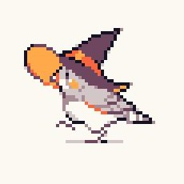

# Ragni 🔥

Text Role Playing Game Motor powered by graphs and large language models.

Ragni is an intelligent companion that will be interacting with the player in their adventures.

The world will be represented in a graph database, all the possible places, characters, objects and scenes.
So when the player makes an action, Ragni will evaluate how to navigate in the graph in order to provide the answers.

Actual features:

- Create a Neo4j database from an obsidian vault
- Local LLM Integration backed by Ollama
- Simple chatbot for telegram and terminal

Future features:

- Generation of world graph from unstructured data
- Tooling system for the interaction between the model and the graph