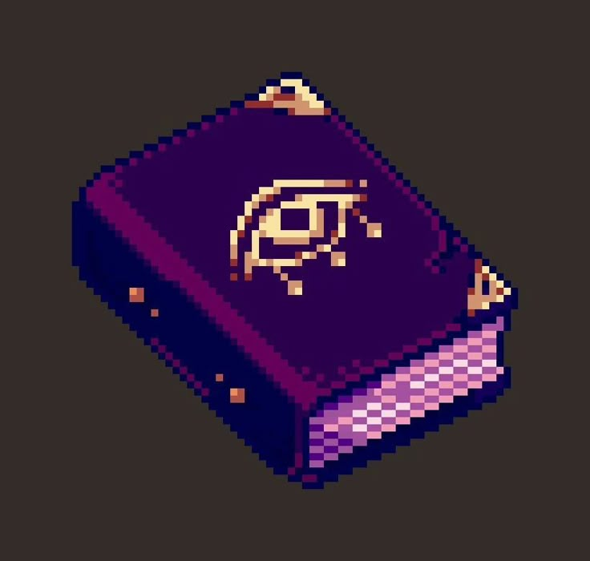

# Seshat :book:

Seshat is a knowledge retriever powered by LLMs

Actual features:

- Create a Neo4j database from an obsidian vault
- Local LLM Integration backed by Ollama
- Simple chat interface for telegram and terminal

Future features:

- Generation of graph from unstructured data
- Tooling system for the interaction with graphs
